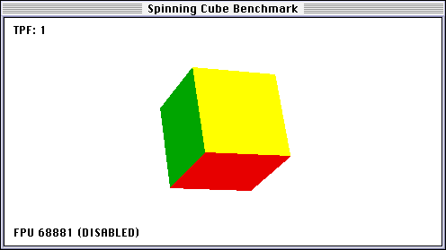

# cube-bench-classic
*A new benchmark for Classic Macintosh Computers*

Cube Bench Classic is a very simple benchmark involving a cube designed for Classic Mac OS System 7. Requires Color QuickDraw.

I wanted something a bit more relatable than a bar chart or flashing patterned rectangles to get a feel for performance differences between classic Macs (LC III, etc.). So for #Marchintosh 2024, I wrote my own benchmark with the classic bouncing cube(s).



Cube Bench Classic is designed to stress the CPU, FPU, and memory bus. Being a System 7 application, everything software rendering is pretty much the only game in town. Cube Bench Classic uses floating point arithmetic for pretty much everything to stress the FPU. Particularly, the cube is rotated using transcendentals (i.e., trigonometric functions).

Drawing on the screen is done using QuickDraw lines and filled polygons. Every QuickDraw call seems to force a screen refresh so something had to be done to avoid flickering. There's no way to flip buffers in QuickDraw that I could, so the usual double-buffering wasn't an option. Instead, rendering is done on an Offscreen Graphics World (back buffer) before copying to the Onscreen Graphics World (front buffer). This stresses the memory bus.

## Compilation

Developed with Symantec C++ for Macintosh 7.0, using a mix of real hardware, working in BasiliskII, or in VS Code. Mostly in BasiliskII.

To compile, open the Project Manager and create a new Mac Application Project. Add the contents of cubes/ and then add a few libraries:

* ANSI++
* CPlusLib
* MacTraps (this should be there by default)

You may want to set Symantec C++ and THINK C options (Compiler Settings) to make use of your hardware FPU if present:

* Generate 68881 instructions
* Use 881 for transcendental

### Line endings

This repository currently is set to use CRLF line endings via .gitattributes so that files are somewhat readable no matter what operating system they are read on.

Classic Mac OS expects CR line endings, so opening the files as is will show a square character. To remove these, convert the files using the `dos2unix` and `unix2mac` tools from the [`dos2unix`](https://waterlan.home.xs4all.nl/dos2unix.html) package.

Convert to CR line endings:

```bash
find . -type f -a \( -name '*.cpp' -o -name '*.h' \) | xargs dos2unix
find . -type f -a \( -name '*.cpp' -o -name '*.h' \) | xargs unix2mac
```

Convert back to CRLF line endings:

```bash
find . -type f -a \( -name '*.cpp' -o -name '*.h' \) | xargs mac2unix
find . -type f -a \( -name '*.cpp' -o -name '*.h' \) | xargs unix2dos
```

### Configuration

Program configuration options are stored in `config.h`. Resolutions can be tweaked with the `SHRINK` setting here, changing how much smaller the window is than screen resolution. `LONG_STATS` defines the number of frames that make up the benchmark, and changing it will change the length of the benchmark.

### Versioning

Program version is kept in `CUBE_VERSION` defined in `version.h`. This can be updated automatically with a `.git/hooks/post-commit` script containing

```bash
#!/bin/bash
COMMIT_HASH=$(git rev-parse --short HEAD)
VERSION_FILE="cubes/version.h"
echo "Updating version to $COMMIT_HASH"
sed -i "s/[0-9a-f]\{7\}/$COMMIT_HASH/" $VERSION_FILE
```

## Partition size

If your Mac has as resolution higher than 640x480 at 256 colours, you will need to increase the partition size in order to run the application. This can either be done using Get Info (⌘I) in the Finder and entering a larger 'Preferred size', or during compilation going to the 'Project' menu, selecting 'Set Project Type...', and entering a larger value in the 'Partition (K)' field.

A 512 K partition size is fine for 800x600 at 256 colours, which is as high as I can test on real hardware.

## Usage

Command-R to run from within Symantec C++. To quit, click anywhere outside the window or press return or escape.

There are a lot of keyboard commands, check out the section below for details, or press the h key to bring up on screen help. More cubes can be shown on screen and the cube moved, or set to bounce.

Press the b key to begin a benchmark. This will render the same 3600 frames and will take 5-10 minutes. Pressing any keys while the benchmark is running will cancel the benchmark. The final result is shown as a frame time stat (see below). Once the benchmark has run the cubes will stop moving. At this point you may screenshot using the shift-p to record the result. Any other key will clear the result.

Performance is displayed a few different ways:
* First is a per-frame measure of TPF, or ticks per frame. One tick corresponds to one screen refresh, generally about 1/60th of a second.
* Second, a more traditional FPS or frames per second is displayed. This is a mean taken over a 30 frame rolling average plus or minus the standard deviation. 
* Third is FT or frame time, which is the time taken to generate each frame in milliseconds. This is inversely proportional to FPS and is also displayed as a 30 frame mean plus or minus the standard deviation.
* Fourth is the benchmark result as mean frame time plus or minus the standard deviation after 3600 frames.

The 95th percentile FPS will be approximately the mean minus two standard deviations, and the 99th percentile approximately minus three standard deviations.

Tested under System 7.5.3 on an LC, LC II, LC II, LC 475, and BasiliskII 1.0.0_p20240224. Seems to crash in BasiliskII with a large window size for reasons unknown. Tested under System 7.1 on a SE.

### Key bindings

| Key | Action                                    |
| --- | ----------------------------------------- |
| `   | Quit                                      |
| ret | Quit                                      |
| esc | Quit                                      |
| b/B | Run benchmark                             |
| c/C | Clear (erase) canvas                     |
| f/F | Toggle filled cube faces                  |
| h/H | On screen help message                    |
| m/M | Toggle movement                           |
| n/N | Toggle rotation                           |
| P   | Save a screenshot to a BMP image          |
| T   | Save benchmark results to a text file     |
| r   | reset all active cubes                    |
| R   | randomise all active cubes                |
| v/V | Toggle invert background colour           |
| spc | Toggle rotation & movement                |
| -/+ | -/+ (decrease/increase) current cube size |
| 0-9 | select & toggle the current cube 0 to 9   |
| j/l | -/+ x-rotate current cube                 |
| i/k | -/+ y-rotate current cube                 |
| u/o | -/+ z-rotate current cube                 |
| J/L | -/+ x-rotation speed of current cube      |
| I/K | -/+ y-rotation speed of current cube      |
| U/O | -/+ z-rotation speed of current cube      |
| a/d | -/+ x-move current cube                   |
| w/s | -/+ y-move current cube                   |
| q/e | -/+ z-move current cube                   |
| A/D | -/+ x-velocity of current cube            |
| W/S | -/+ y-velocity of current cube            |
| Q/E | -/+ z-velocity of current cube            |

The default current cube is cube 1. Clicking outside the window will also quit.

### Known issues

Immediately quits

* This will happen if either Cube Bench Classic has been compiled to use a FPU and one is not detected (1 beep) or if System version is less than 7 (2 beeps).

Multiple screens, maybe?

* Window size is determined from `screenBits`, which documentation suggests doesn't acknowledge the existence of multiple screens. If you have two screens, the window may span across multiple screens.

1-bit colour

* Only so much you can do with black and white, but that aside there may be some instances where things disappear due to not calling `ForeColor(whiteColor)`. File an issue please.

Saving screenshots

* Sometimes the background looks a bit pink. Are you in 16-bit ("Thousands of Colors") mode? 16-bit bitmaps are scuffed, with missing green precision, due to Motorola 68000 CPUs being big-endian and BMP needing little-endian (as written at least). What image editors do with the left over bits varies. Try opening in another image editor, e.g., the [GNU Image Manipulation Program](https://www.gimp.org/).

* There's some garbage on the sides of the screenshot. This is expected. Sometimes the buffer we are saving a copy of is larger than what is displayed on screen due to Apple aligning the underlying buffer to memory for faster copies. You may safely ignore these parts of the image.

* One beep during saving a screenshot indicates an issue selecting the save file.

* Two beeps during saving a screenshot indicate an issue writing the image data.
