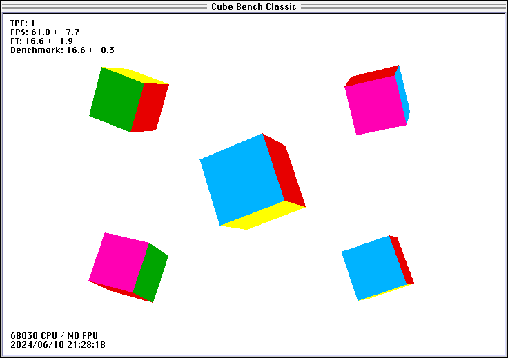

# cube-bench-classic
A very simple benchmark involving a cube for Classic Mac OS System 7

I wanted something a bit more relatable than a bar chart or flashing patterned rectangles to get a feel for performance between classic Macs (LC III, etc.). So for #Marchintosh 2024, I wrote my own benchmark with the classic bouncing cube(s). A relatable mix of floating point, regular computation, and QuickDraw calls.

## Compilation

Developed with Symantec C++ for Macintosh 7.0, using a mix of real hardware, working in BasiliskII, or in VS Code. Mostly in BasiliskII.

To compile, open the Project Manager and create a new Mac Application Project. Add the contents of cubes/ and then add a few libraries:

* ANSI++
* CPlusLib
* MacTraps (this should be there by default)

You may want to set Symantec C++ and THINK C options (Compiler Settings) to make use of your hardware FPU if present:

* Generate 68881 instructions
* Use 881 for transcendental

### Line endings

Note that Classic Mac OS expects CR line endings. The .gitattributes should enforces these for source files, but note that `git diff` does not like them, so you may need to use another tool for comparing to previous revisions, e.g., [`meld`](http://meldmerge.org/). The [`dos2unix`](https://waterlan.home.xs4all.nl/dos2unix.html) can be used to change between line endings.

## Partition size

If your Mac has as resolution higher than 640x480 at 256 colours, you will need to increase the partition size in order to run the application. This can either be done using Get Info (⌘I) in the Finder and entering a larger Preferred size, or during compilation going to the Project menu, selecting Set Project Type..., and entering a larger value in the Partition (K) field.

A 512 K partition size is large for 800x600 at 256 colors, which is as high as I can test on real hardware.

## Usage

Command-R to run from within Symantec C++. To quit, click anywhere outside the window.

There are a lot of keyboard commands, check out the but switch statement in [main.cpp](cubes/main.cpp) for details.

At some point the h key will bring up on screen help.

Tested under System 7.5.3 on an LC, LC II, LC II, LC 475, and BasiliskII 1.0.0_p20240224. Seems to crash in BasiliskII with a large window size for reasons unknown.

Performance is displayed as TPF, or ticks per frame. One tick corresponds to one screen refresh, and so will be about 1/60th of a second for most people.
